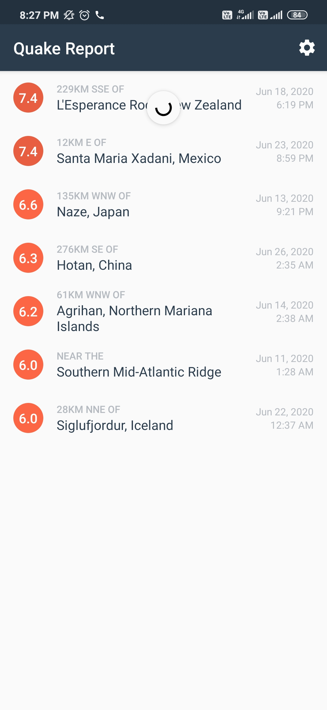
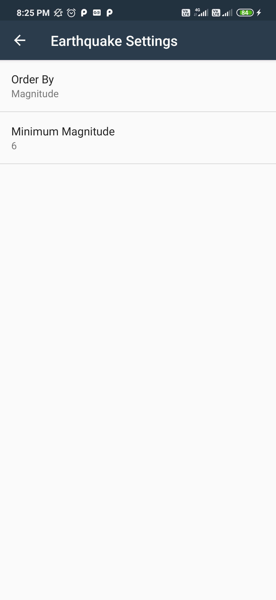
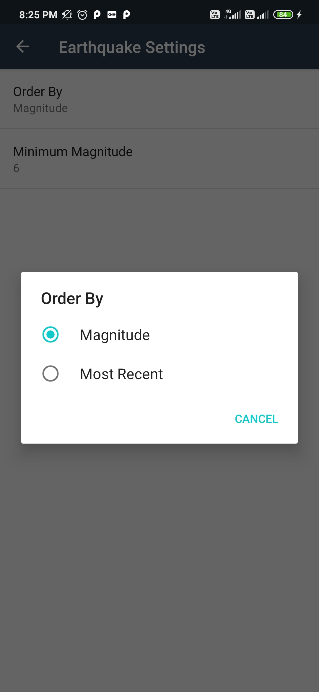
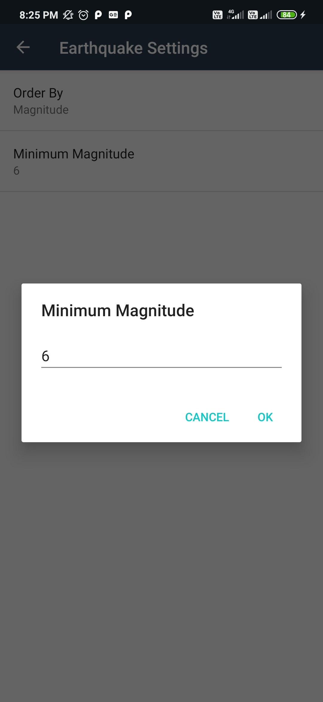

Quake Report App
===================================

This app displays lists of earthquakes from usgs server.
Used in a Udacity course in the Beginning Android Nanodegree.

API used
=====

https://earthquake.usgs.gov/fdsnws/event/1/

## Screenshots

<table>
<tr>
<td></td>
<td></td>
</tr>
<tr>
<td></td>
<td></td>
</tr>
</table>
